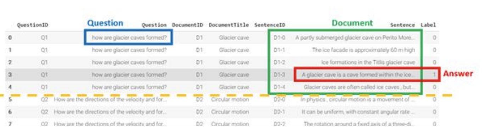
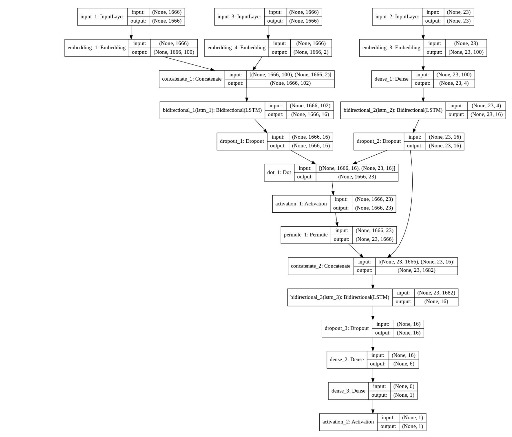
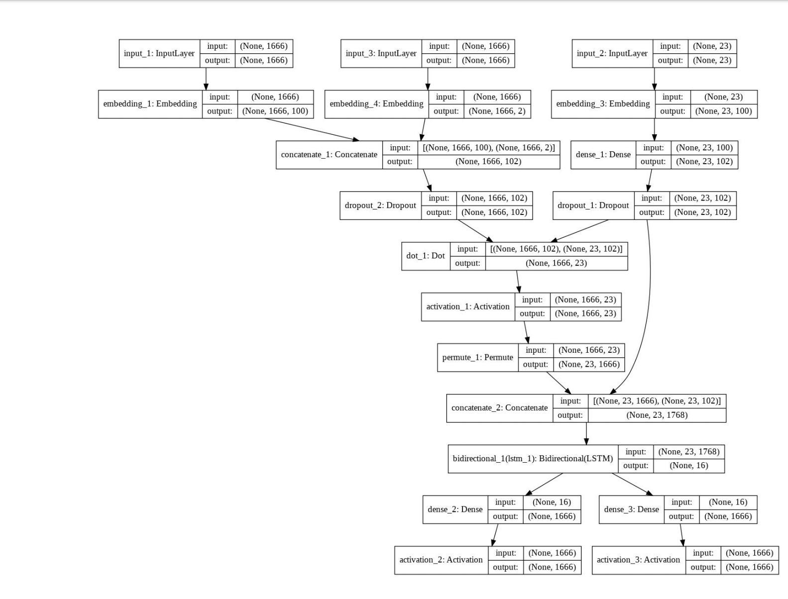

# QA-Question-Answering-framework

The QA framework read document/text and answer questions about it. It is using Sequence model, different NLP features and data of Microsoft Research [WikiQA Corpus](https://www.aclweb.org/anthology/D15-1237/).

## Data
### Raw Data

The [train](WikiQA-train.tsv) and [test](WikiQA-test.tsv) data set contains the following attributes:
* QuestionID
* Question
* DocumentID 
* DocumentTitle
* SentenceID
* Sentence
* Label (answer sentence, if label=1)

### Data Wrangling 

Construct three different types of data from raw for training the model: Question, Document and Answer as following figure. To construct the document data, we concatenate (with space) each sentence that has same DocumentID. To construct the answer data, we use the sentence that has Label as 1.

The following figure shows the original raw data:

## QA Framework
### Please refer to the [report.pdf](report.pdf) for more details

### Word Embeddings and Feature Extraction
The pre-trained word embedding layer used is **gloVe** with word vector size = 100, which is the size that is popular in industry and  it is reasonable in terms of computational time and performance as having largest size does not seems to improve performance significantly while computational time and memory usage increases the same time.

There are 4 different Features have been extracted from the Dataset. They are the 
* PoS tags
* TF-IDF
* Named Entity tags
* Word match feature

To quickly summarise, the best features is Word match feature in terms of training accuracy. One potential reason is that Word Match Feature directly exposes mutual information between Document and Question as Word match contains information about tokens appear on both Document and Question. 

### Sequence Model (RNN with Attention)
#### Pipeline architecture
Instead of using one single end to end sequence model,  a Pipeline of 2 different sequence models were involved. 
On the following figures there are 2 different sequence model, the **top one** is a Binary Model that classify if a given doc and question has answer or not. 
While on the **bottom one** is a Multi-Label sequence model, that predicts start and end token position given a doc and question.  

The reason for using a Pipeline is that the **labels distribution are highly Imbalance**. 

There are 1666 class (i.e. 1666 possible position of start and end tokens), and most of the data contains no answer, thus belongs class 0. 
While the rest of the data are spread out over classes 1-1665(i.e. 60% of class 0, with the rest 40%  of data spread out over classes 1-1665 thus each class has average of  0.4/1665 proportion), which is very difficult to train a sequence model with good performance  on this highly imbalanced dataset, especially when Colab has limited computational resource for training a high capacity model architecture.

